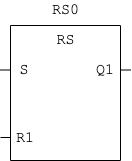

## Introduction

This function block maintains its output in one of two stable states `TRUE` or `FALSE`.
The output can be set or reset by applying a `TRUE` signal to the `Set` or `Reset` inputs.
If both inputs are `TRUE` the output is `FALSE`.



## VAR_INPUT

```
VAR_INPUT
    S  : BOOL;
    R1 : BOOL;
END_VAR
```

## VAR_OUTPUT

```
VAR_OUTPUT
    Q1 : BOOL;
END_VAR
```
Internal implementation:

```
Q1 := (NOT R1) AND (S OR Q1);
```

## Pinout Description

| Pin Name   | Signal | Data Type | Description                                                 |
|------------|--------|-----------|-------------------------------------------------------------|
| `S`        | Input  | `BOOL`    | Set. This input puts the output in True state.               |
| `R1`       | Input  | `BOOL`    | Reset(dominant). This input puts the output in False state. |
| `Q1`       | Output | `BOOL`    | Q. This is the output.                                      |

## Truth Table

| S | R1 |  Q1            | Description                  |
|---|----|----------------|------------------------------|
| 0 |  0 | Q<sub>-1</sub> | Q retains its previous state |
| 0 |  1 |  0             | Q is False                   |
| 1 |  0 |  1             | Q is True                    |
| 1 |  1 |  0             | Q is False                   |

## Time Diagram


